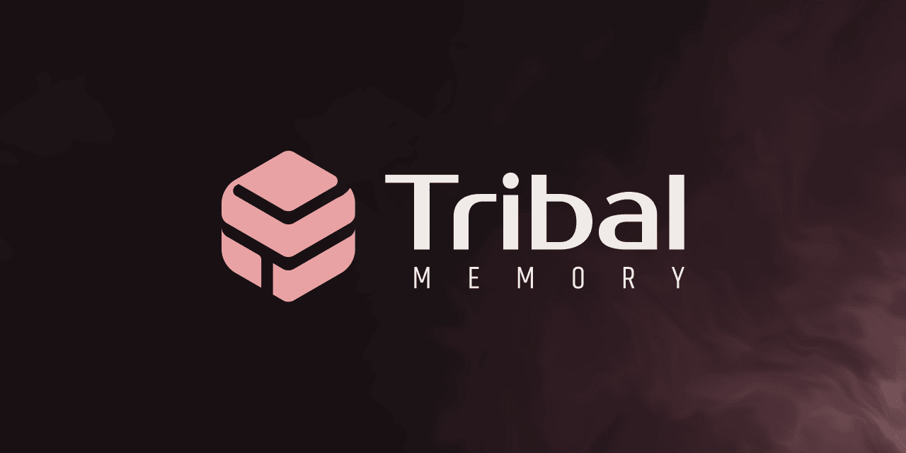

<p align="center">
  <a href="https://tribal.build">
    
  </a>
</p>

# Tribal

Semantic compression for project knowledge.

[](https://github.com/tribal-memory/tribal/releases)
[](https://github.com/tribal-memory/tribal/actions/workflows/ci.yml)
[](LICENSE)
[](https://github.com/tribal-memory/tribal/pkgs/container/tribal)
[](https://github.com/tribal-memory/homebrew-tap)

Tribal captures the engineering knowledge that does not get written down in code or tickets. The reasoning behind a load-bearing decision, the heuristic someone keeps reaching for, the breakthrough that closed a gnarly bug. It runs as a Model Context Protocol server, ingests text on demand, and exposes a graph of items connected by what they support, contradict, or refine. Your agent harness talks to it the same way it talks to any other MCP tool.

Tribal is not trying to remember everything. It preserves what remains useful after the work is done.

## Quick start

**Start with the skills.** Tribal runs inside your agent, and the [skills](https://github.com/tribal-memory/skills) teach it to install, verify, wire, and troubleshoot Tribal. Installing them and letting the agent drive is the most reliable path:

```bash
npx skills add tribal-memory/skills
```

Then ask your agent to set Tribal up. The steps below are what the skills walk it through, or what to run by hand. The agent can help either way.

If you plan to use a cloud provider (OpenAI or Anthropic), export its API key in your shell **before** you launch the agent harness, so the harness and the Tribal binary it spawns inherit it. A key exported into a terminal the harness is already running in is not picked up until you relaunch. Setting it up front removes a lot of the early configuration friction.

Install Tribal using whichever path fits your environment. Pick one:

**Homebrew (macOS)**

```bash
brew install tribal-memory/homebrew-tap/tribal
```

**Shell installer (macOS or Linux)**

```bash
curl --proto '=https' --tlsv1.2 -LsSf \
  https://github.com/tribal-memory/tribal/releases/latest/download/tribal-installer.sh | sh
```

**Docker Compose (bundled Postgres)**

```bash
tag=$(curl -fsSL https://api.github.com/repos/tribal-memory/tribal/releases/latest | jq -r .tag_name)
mkdir tribal-docker && cd tribal-docker
curl -fsSL "https://raw.githubusercontent.com/tribal-memory/tribal/$tag/docker-compose.yml" -o docker-compose.yml
docker compose up
```

The compose file pins the image to a specific release, so fetch it from a release tag rather than reusing an old checkout. The stack bundles its own Postgres and bootstraps itself on first start. To point a stage at a cloud provider instead of a local Ollama, configure `.env` before the first `docker compose up`; the [`installing-tribal` skill](https://github.com/tribal-memory/skills/tree/main/skills/installing-tribal) walks through it.

For the Homebrew and shell-installer paths, bootstrap from inside a git repository. This runs setup, registers the repository as a project, mints a bearer token, and prints the MCP config snippet your harness will need:

```bash
tribal bootstrap
```

## Prerequisites

- Postgres 14 or higher with the `pgvector` extension.
- A provider for embeddings and inference. Either a local Ollama installation with the required models, or API keys for a supported cloud provider set in your environment.

`tribal bootstrap` never calls a provider, but it does validate configuration, so a configured cloud provider's API key must already be in your environment when you run it. Provider reachability for ingest is verified separately by `tribal check --providers`.

## Setting up

`tribal bootstrap` is the canonical first run. It asks the local manager to initialise the configured database, apply model and graph settings, optionally register a working tree, and ensure a namespaced default credential. It is safe to run again against the same durable state:

```bash
tribal bootstrap
```

Flags worth knowing:

- `--project-path DIRECTORY` includes project registration in the bootstrap composition. Omit it when initialising an unscoped deployment.
- `--transport stdio|http|sse` chooses the integration receipt's connection shape. Omission follows the configured transport.
- `--auth oauth|persisted-bearer` selects network authentication. Exporting a bearer is explicit and is not available for stdio.
- `--json` emits a structured JSON record of everything that happened. Useful for scripting and for piping into the diagnostic flow described below.

Bootstrap composes the same typed manager capabilities available under `tribal database`, `tribal project`, `tribal token`, and `tribal integration`; those commands never open the database or credential store independently.

## Verifying readiness

`tribal check` runs the core diagnostic suite: configuration, database reachability, migration state, project resolution, token validity, advertised URL reachability, and binary uniqueness on PATH. It exits non-zero if any check fails.

```bash
tribal check
```

Add `--providers` to extend the suite with fatal probes of the embedding and inference providers. Run this before your first ingest to confirm the system can do real work:

```bash
tribal check --providers
```

For scripted consumers, `--json` emits a structured record. Every failed check includes a `remediation` field with the exact next step:

```bash
tribal check --json
```

## Connecting to your agent harness

The canonical MCP config for any compatible harness comes from `tribal integration mcp-config`. On a local HTTP or SSE deployment the default OAuth document is URL-only. Pass `--auth persisted-bearer` to make the secret-bearing export explicit for a harness that only supports an `Authorization` header. The stdio document carries no token and starts explicitly unscoped or with the selected project context.

For per-harness translations, ask your agent to invoke the [`installing-tribal` skill](https://github.com/tribal-memory/skills/tree/main/skills/installing-tribal). It walks through wiring Tribal into your harness and produces the exact command to run.

## Using Tribal

Day-to-day use happens through your harness. Once the MCP server is wired up, the harness can ingest knowledge, query it, traverse the graph, and rate retrieval quality.

The [`using-tribal` skill](https://github.com/tribal-memory/skills/tree/main/skills/using-tribal) teaches your harness when and how to call each tool, and how to phrase ingests so they survive in the graph long after the work is done. It activates whenever the harness sees a signal that prior context might be relevant, or that something worth preserving has just happened.

## Recovery

Most operational issues fall into a small set of patterns:

- **Port already in use.** Tribal exits with the conflicting address in the error message. Free the port, or switch to `--transport stdio` to bypass network binding.
- **Bad credentials state.** Re-run `tribal bootstrap`; the manager recovers or replaces the namespaced pending/stable credential pair transactionally.
- **Corrupted Docker volume.** Stop the stack with `docker compose down -v`, then `docker compose up`. The volume is recreated on the next start.
- **Stale project context.** If `TRIBAL_PROJECT_ID` is set in your environment to a project that no longer exists, unset it or re-run `tribal bootstrap` against the current directory's git remote.
- **Missing provider env vars.** `tribal check --providers` names which provider stage is failing and walks the resolution chain. Set the missing variable and re-run.

Logs are written to standard error. Every command that has a useful structured form supports `--json`; the structured output is more amenable to parsing than the human stderr stream.

To re-bootstrap cleanly without losing your knowledge graph, run `tribal bootstrap` again. It will reuse the existing project if the git remote matches, mint a new bearer token, and re-emit the MCP config snippet.

## Troubleshooting

`tribal check` is the first stop for any operational issue. It surfaces failures with a `remediation` field describing the next action in plain prose. Pass `--json` when you need to consume the structured form.

When `tribal check` reports `ok: true` and a problem is still visible, the issue is usually network-level rather than Tribal itself. The most common pattern is a VPN or firewall sitting between the binary and the database; MCP errors look like Tribal is down even though the database is what's broken. Confirm connectivity to the configured database before assuming Tribal is at fault.

For runtime failure modes that fall outside the check suite (worker death, transport-layer errors, prompt loading failures), the [`using-tribal` skill](https://github.com/tribal-memory/skills/tree/main/skills/using-tribal) bundles a reference covering each pattern. Install it via [the Quick start one-liner](#quick-start) if you haven't already.

## Removing Tribal

Manual steps, in any order:

- Remove the binary. `brew uninstall tribal` for Homebrew installs, the installer's removal script for the shell-installer path, or `docker compose down -v` for the containerised path.
- Delete the namespaced credential directory at `$XDG_CONFIG_HOME/tribal/credentials/`.
- Drop the Postgres database Tribal was using.
- Remove the skills with `npx skills remove installing-tribal using-tribal`.
